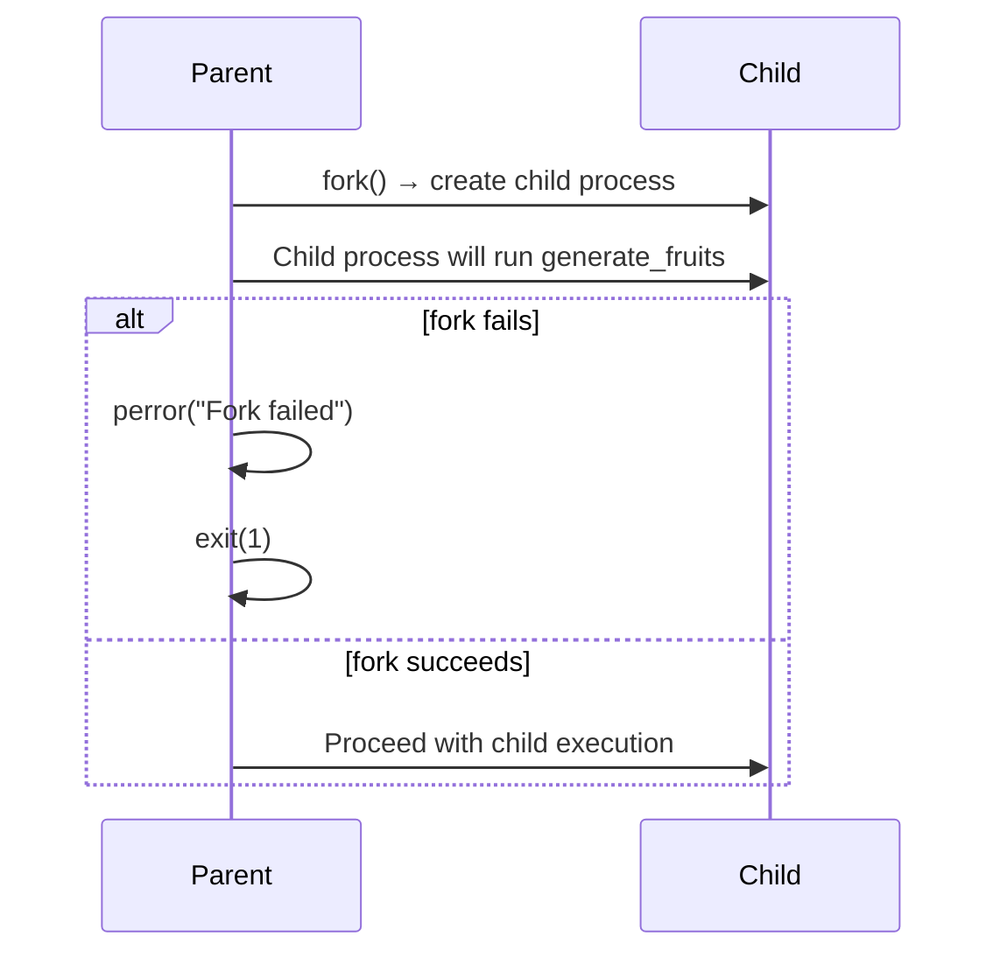
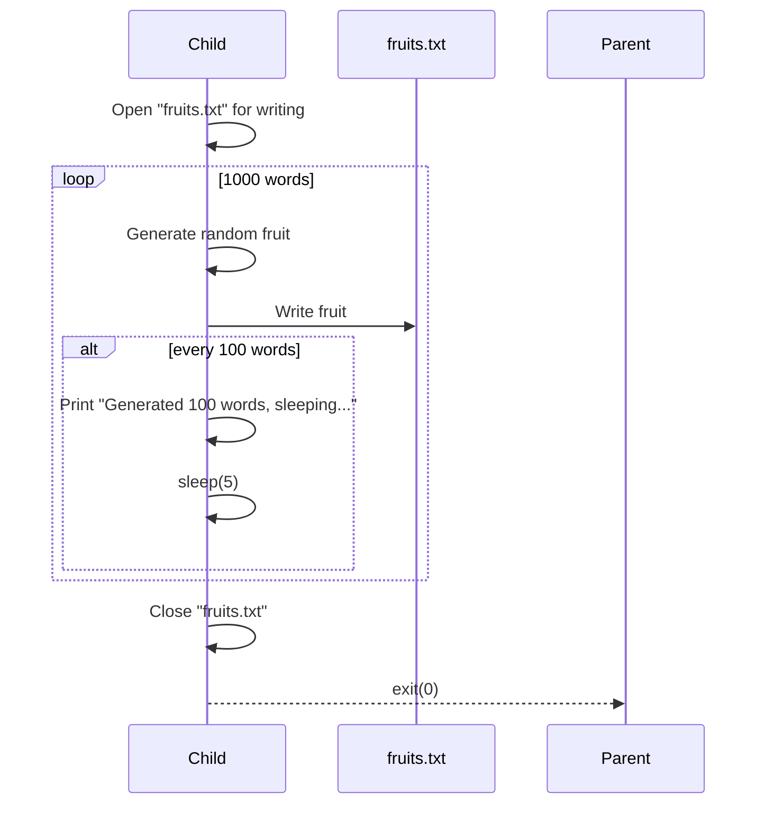
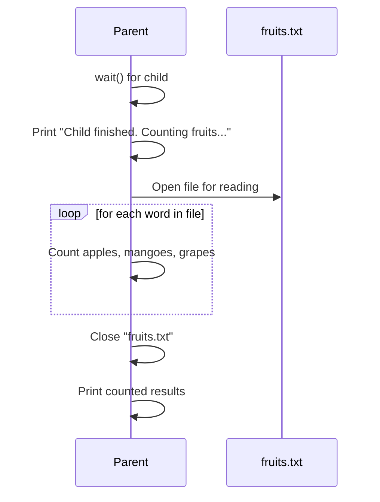
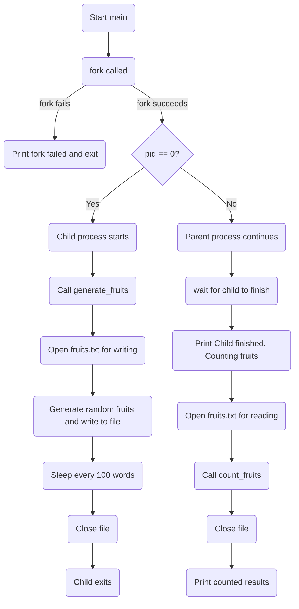
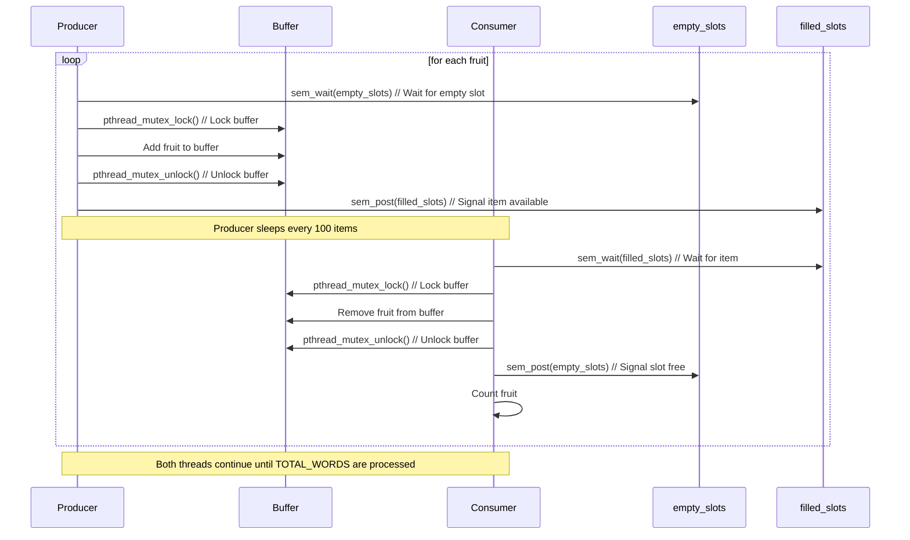
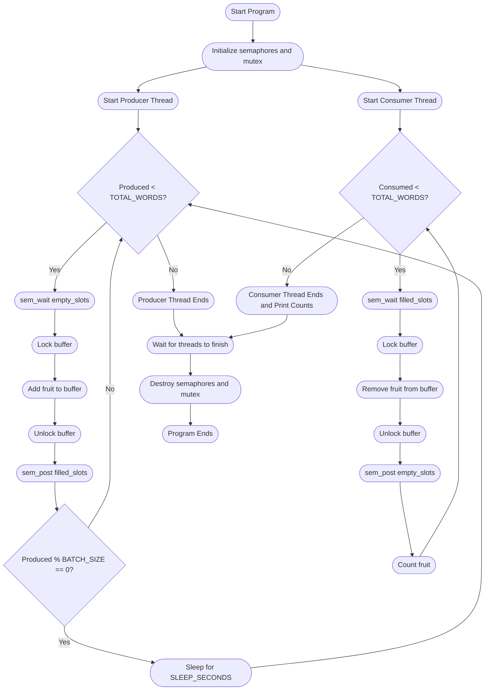
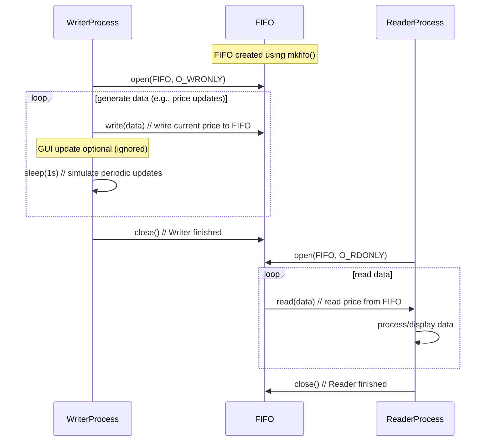
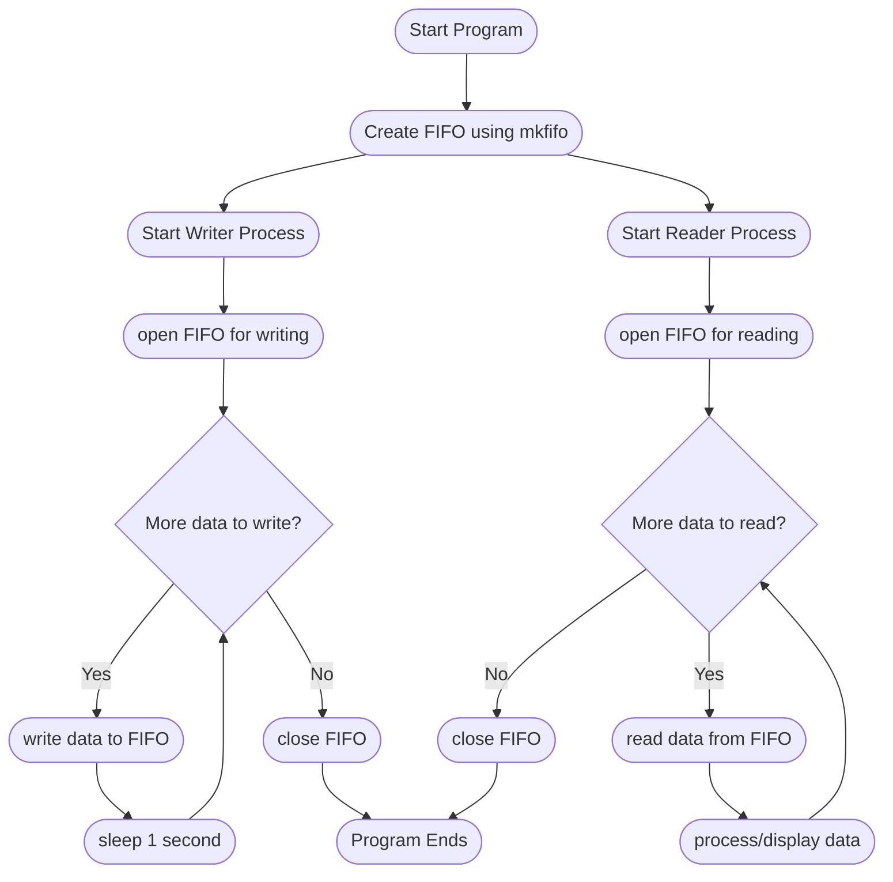

# OS lab Index Table C Sec - Monday Batch

| Experiment No. | Simplified Experiment Title             | Date                |
| -------------- | --------------------------------------- | ------------------- |
| 1              | Process system calls (fork, exec, wait) | 15-09-2025 (Monday) |
| 2              | CPU scheduling algorithms               | 22-09-2025 (Monday) |
| 3              | Producer–consumer using semaphores      | 29-09-2025 (Monday) |
| 4              | Reader–writer IPC using FIFO            | 06-10-2025 (Monday) |
| 5              | Banker’s algorithm (deadlock avoidance) | 13-10-2025 (Monday) |
| 6              | Contiguous memory allocation            | 27-10-2025 (Monday) |
| 7              | Page replacement algorithms             | 03-11-2025 (Monday) |
| 8              | File organization techniques            | 24-11-2025 (Monday) |
| 9              | Linked file allocation                  | 01-12-2025 (Monday) |
| 10             | SCAN disk scheduling                    | 08-12-2025 (Monday) |

# OS lab Index Table C Sec - Wednesday Batch

| Experiment No. | Simplified Experiment Title             | Date                   |
| -------------- | --------------------------------------- | ---------------------- |
| 1              | Process system calls (fork, exec, wait) | 17-09-2025 (Wednesday) |
| 2              | CPU scheduling algorithms               | 24-09-2025 (Wednesday) |
| 3              | Producer–consumer using semaphores      | 08-10-2025 (Wednesday) |
| 4              | Reader–writer IPC using FIFO            | 15-10-2025 (Wednesday) |
| 5              | Banker’s algorithm (deadlock avoidance) | 29-10-2025 (Wednesday) |
| 6              | Contiguous memory allocation            | 05-11-2025 (Wednesday) |
| 7              | Page replacement algorithms             | 26-11-2025 (Wednesday) |
| 8              | File organization techniques            | 03-12-2025 (Wednesday) |
| 9              | Linked file allocation                  | 10-12-2025 (Wednesday) |
| 10             | SCAN disk scheduling                    | 17-12-2025 (Wednesday) |

1. Mermaid Markdown 
2. lucid Chart
🔗[website](https://www.lucidchart.com/pages)

# Experiment 1: Develop a c program to implement the Process system calls (fork (), exec(), wait(), create process,terminate process)

### Sequence Diagram

#### **Section 1: Forking the child process**

---

#### **Section 2: Child generates fruits**

---

#### **Section 3: Parent counts fruits**

### Flow Chart

# Experiment 2: Process Scheduling
🔗[Process Scheduling](https://erpjietuniverse.in/virtual_lab/Operating_system/labs/exp2/theory.html)

# Experiment 3: Develop a C program to simulate producer-consumer problem using semaphores.

### Sequence Diagram

### Activity / Flow Chart

# Experiment 4: Inter Process Communication using mkfifo
### Sequence Diagram

### Activity / Flow Chart

# Experiment 5: Bankers Algorithm
🔗[PPT: Bankers Page 23 to 29](https://drive.google.com/file/d/1-MBdZEvuBj5Iqi06JaxODA-inlysQEdO/view)

# Experiment 6: Memory Allocation Techniques
🔗[Click Here](https://erpjietuniverse.in/virtual_lab/Operating_system/labs/exp7/theory.html)

# Experiment 7: Page Replacement Algorithms
🔗[Click Here](https://erpjietuniverse.in/virtual_lab/Operating_system/labs/exp8/theory.html)

# Experiment 8: Directory organisation techniques
🔗[Scroll Page 19 to 21](https://drive.google.com/file/d/1LJbQ8V3Xr6lJXIb1tV0b9kafynorp9mr/view?usp=classroom_web&authuser=0)

# Experiment 9: Linked file allocation strategies
🔗[Scroll page 16 to 26](https://drive.google.com/file/d/1jE84lI4pmz7K-bp7GF_PnGA-bdQuWESm/view?usp=classroom_web&authuser=0)

# Experiment 10: Disck Sheduling algorithms
🔗[Click Here](https://erpjietuniverse.in/virtual_lab/Operating_system/labs/exp10/theory.html)